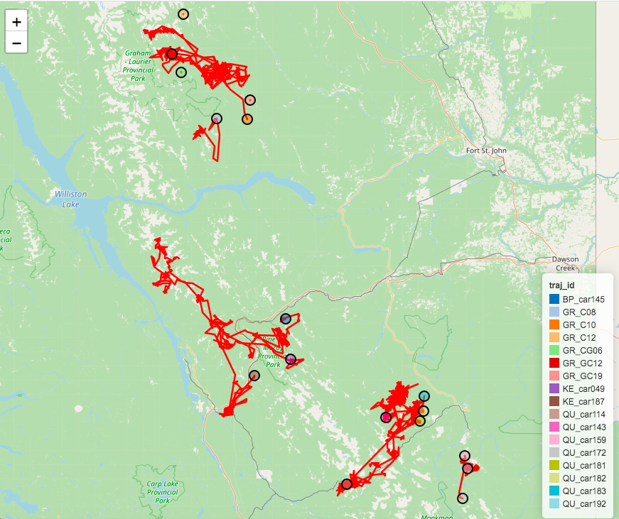

# Armfield Detect Stationarity in GeoTags

MoveApps

Github repository: *github.com/yourAccount/Name-of-App* *(the link to the repository where the code of the app can be found must be provided)*

## Description

Identify and display stops in trajectory data from geotags. Set the time (in hours) and distance (meters) that is 
considered a "stop". Stops are displayed on a map, with the option to view any subsequent movement after the stop.

## Documentation

### Intended Use

This app is intended to be used to aid in analysis of movement data from animal geotags.

Stop detection can be useful for a number of conservation interests, as a "long stop" can indicate than an animals has:
(1) died / been poached
(2) lost its tag
(3) is remaining stationary for some other reason related to its biology / life history (hibernation, birth, etc.)

In order to detect "long stops", this application makes use of the MovingPandas python library, and allows the user to 
define a "stop" of interest via the configuration parameters.

Furthermore, the stops detected are displayed on a map, along with any subsequent movement after the stop began 
if desired (see Settings). Viewing the trajectory after the stop began may be useful in determining which of the 
scenarios (death, tag loss, injury, etc) the stop actually represents. For example, if a user is trying to detect 
deaths or tag loss, a subsequent movement of 200,000 meters could indicate that the animal has not died, but stopped 
for some other reason. Thus, the user could consider re-running the application with more conservative settings 
(i.e. increasing stop duration time and / or decreasing stop diameter size).

### Example Stop Detection in Caribou Dataset

source: Movebank study - 216040785 / Mountain caribou in British Columbia

Say a user wants to detect possible deaths among caribou present in this study. The first time running this application, 
the user sets the app configuration to the following:

and sees the following map at output:

This map shows the location of stop points, along with the trajectory of the animal following the stop. We can see that 
many of these animals go on to travel great distances, making a death or tag loss unlikely. 

Perhaps 120 hours spent within 100 meters is not a conservative enough test for whether a caribou has died. We 
increase the stop_duration to 150 hours, and get the following result:

which shows much less post stop movement and 
fewer individuals.
### Application Execution

The app iterates through all provided Trajectories and searches for stop points. For each stop detected, a 
point is added to the output map. Data for each stop is also stored as a dataframe, which is output as a CSV file.

### Input data

MovingPandas TrajectoryCollection in Movebank format

### Output data

MovingPandas TrajectoryCollection in Movebank format

### Artefacts

- `map.html` - an HTML file containing the Folium map, displaying stop points, with option to hover over points to show more data and zoom in / out.
- `final_stops.csv` - a csv file containing the final stop points for individuals (i.e. most recent stop if there are more than one for a given individual), detected matching the configuration parameters, with the following columns: 
  - `stop_id`: string - the unique identifier for the stop (trajectory_id + start_time of stop)
  - `geometry`: point - the latitude and longitude position of the stop
  - `start_time`: timestamp - the time the stop began,
  - `end_time`: timestamp - the time the stop ended
  - `traj_id`: string - the unique identifier of the trajectory that this stop was detected in 
  - `duration_s`: time dur,final_observation_time,time_tracked_since_stop,mean_rate_all_tracks,distance_traveled_since_stop,average_rate_since_stop
If the setting `Final stop only` is `False`, an additional csv file will be output:
- `all_stops.csv` - a csv file containing all the stop points detected matching the configuration parameters, with the following columns:

### Settings 

The following settings are required:

- `Minimum duration in hours` (hours): The minimum duration in hours that is considered a stop of interest (death or tag loss probable). Unit: `hours`.
- `Maximum stop diameter` (meters): Defined diameter that the animal has to stay in for the configured time for it to be considered stop. Unit: `meters`.
- `Final stop only` (boolean): If only the last stop in a trajectory (that is, the most recent stop) should be considered (displayed on the output map and output to `all_stops.csv` file), in the case that more than one stop exist for a given individual. `True` or `False`.

### Null or error handling

**Setting `Minimum duration in hours`:** If no Minium duration is given (NULL), then a default duration of 120 hours (5 days) is set. 
**Setting `Maximum stop diameter`:** If no Maximum stop diameter is given, then a default diameter of 100 meters is set.
**Setting `Display final stop only`:** If no selection for Display final stop only is given, then a default value of `True` is set.

